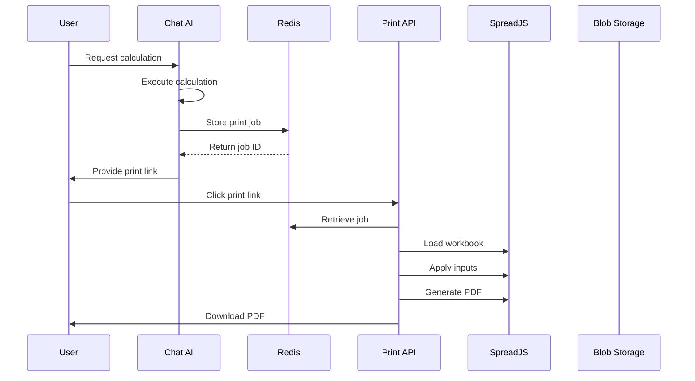

# SpreadAPI PDF Printing Functionality

## Overview
This document outlines the implementation of a Redis-based PDF printing system that allows users to generate shareable PDF links from calculation results. The system integrates with the AI chat interface and MCP tools to provide seamless PDF generation from SpreadJS workbooks.

## Architecture Flow



## Redis Schema

### Print Job Structure
```typescript
interface PrintJob {
  id: string;                    // Format: "pj_{timestamp}_{random}"
  serviceId: string;              // Service to execute
  userId: string;                 // User who created the job
  inputs: Record<string, any>;   // Input parameters for calculation
  token?: string;                 // Optional auth token
  status: 'pending' | 'processing' | 'completed' | 'failed';
  createdAt: string;              // ISO timestamp
  expiresAt: string;              // ISO timestamp (24 hours)
  printSettings?: {
    printArea?: string;           // e.g., "Sheet1!A1:G20"
    orientation?: 'portrait' | 'landscape';
    fitToPage?: boolean;
    scale?: number;
    margins?: {
      top: number;
      bottom: number;
      left: number;
      right: number;
    };
  };
  metadata?: {
    title?: string;               // PDF title
    description?: string;         // For context
    calculationType?: string;     // e.g., "loan_amortization"
  };
  result?: {
    pdfUrl?: string;              // Cached PDF URL
    generatedAt?: string;         // When PDF was generated
  };
}
```

### Redis Keys
```
print:job:{jobId}              - Individual print job
print:user:{userId}:jobs       - Set of job IDs per user
print:service:{serviceId}:jobs - Set of job IDs per service
print:stats:daily:{date}       - Daily generation statistics
```

### TTL Strategy
- Print jobs: 24 hours
- Generated PDFs in blob storage: 7 days
- Statistics: 30 days

## API Endpoints

### 1. Create Print Job
```typescript
POST /api/print/jobs
Authorization: Bearer {token}
Content-Type: application/json

{
  "serviceId": "spapi_live_xyz",
  "inputs": {
    "A1": 100000,
    "B1": 5.5,
    "C1": 30
  },
  "printSettings": {
    "orientation": "portrait",
    "fitToPage": true
  },
  "metadata": {
    "title": "Loan Calculation Report",
    "calculationType": "loan_amortization"
  }
}

Response:
{
  "jobId": "pj_1737823456_abc123",
  "printUrl": "https://spreadapi.io/print/pj_1737823456_abc123",
  "expiresAt": "2025-01-26T10:00:00Z"
}
```

### 2. Generate PDF
```typescript
GET /print/{jobId}
GET /api/print/{jobId}/pdf

Response: PDF file download
```

### 3. Get Print Job Status
```typescript
GET /api/print/jobs/{jobId}/status

Response:
{
  "jobId": "pj_1737823456_abc123",
  "status": "completed",
  "pdfUrl": "https://cdn.spreadapi.io/pdfs/abc123.pdf",
  "expiresAt": "2025-01-26T10:00:00Z"
}
```

## Dynamic Import Strategy

### Why Dynamic Imports?
The SpreadJS PDF libraries are large (~2MB+). Loading them only when needed improves initial page load performance.

### Implementation
```typescript
// /lib/pdf/generator.ts
export async function generatePDF(workbook: any, settings: PrintSettings) {
  // Dynamically import PDF module only when needed
  const { default: GC } = await import('@mescius/spread-sheets');
  const { IO } = await import('@mescius/spread-sheets-io');
  const { PDF } = await import('@mescius/spread-sheets-pdf');
  
  // Configure PDF settings
  const printInfo = workbook.getActiveSheet().printInfo();
  
  if (settings.printArea) {
    printInfo.printArea(settings.printArea);
  }
  
  if (settings.orientation) {
    printInfo.orientation(
      settings.orientation === 'landscape' 
        ? GC.Spread.Sheets.Print.PrintPageOrientation.landscape
        : GC.Spread.Sheets.Print.PrintPageOrientation.portrait
    );
  }
  
  // Generate PDF
  return new Promise((resolve, reject) => {
    workbook.savePDF(
      (blob: Blob) => resolve(blob),
      (error: any) => reject(error),
      {
        title: settings.metadata?.title || 'SpreadAPI Report'
      }
    );
  });
}
```

## MCP Tool Integration

### Tool Definition
```json
{
  "name": "create_print_link",
  "description": "Generate a shareable PDF print link for calculation results",
  "inputSchema": {
    "type": "object",
    "properties": {
      "serviceId": {
        "type": "string",
        "description": "The service ID to execute"
      },
      "inputs": {
        "type": "object",
        "description": "Input parameters for the calculation"
      },
      "title": {
        "type": "string",
        "description": "Title for the PDF document"
      },
      "orientation": {
        "type": "string",
        "enum": ["portrait", "landscape"],
        "description": "Page orientation for the PDF"
      }
    },
    "required": ["serviceId", "inputs"]
  }
}
```

### MCP Server Implementation
```typescript
// /app/api/mcp/server/route.ts
async function handleCreatePrintLink(params: any) {
  const { serviceId, inputs, title, orientation } = params;
  
  // Create print job in Redis
  const jobId = `pj_${Date.now()}_${generateRandomId()}`;
  
  const printJob: PrintJob = {
    id: jobId,
    serviceId,
    userId: context.userId,
    inputs,
    status: 'pending',
    createdAt: new Date().toISOString(),
    expiresAt: new Date(Date.now() + 24 * 60 * 60 * 1000).toISOString(),
    printSettings: {
      orientation: orientation || 'portrait',
      fitToPage: true
    },
    metadata: {
      title: title || 'SpreadAPI Calculation Report'
    }
  };
  
  await redis.setex(
    `print:job:${jobId}`,
    86400, // 24 hours
    JSON.stringify(printJob)
  );
  
  return {
    jobId,
    printUrl: `https://spreadapi.io/print/${jobId}`,
    expiresAt: printJob.expiresAt,
    message: `Print link created: https://spreadapi.io/print/${jobId}`
  };
}
```

### Claude Desktop Configuration
```json
{
  "mcpServers": {
    "spreadapi": {
      "command": "npx",
      "args": [
        "-y",
        "@spreadapi/mcp-server"
      ],
      "env": {
        "SPREADAPI_TOKEN": "spapi_live_xxx"
      }
    }
  }
}
```

## Chat AI Integration

### Modified Chat Route
```typescript
// /app/api/chat/route.js
async function generatePrintLink(serviceId, inputs, userId) {
  const jobId = `pj_${Date.now()}_${generateRandomId()}`;
  
  const printJob = {
    id: jobId,
    serviceId,
    userId,
    inputs,
    status: 'pending',
    createdAt: new Date().toISOString(),
    expiresAt: new Date(Date.now() + 24 * 60 * 60 * 1000).toISOString()
  };
  
  await redis.setex(
    `print:job:${jobId}`,
    86400,
    JSON.stringify(printJob)
  );
  
  return `https://spreadapi.io/print/${jobId}`;
}

// In the AI response generation
if (calculationSuccessful) {
  const printUrl = await generatePrintLink(serviceId, inputs, userId);
  
  response += `\n\n📄 [Download PDF Report](${printUrl})\n`;
  response += `*This link expires in 24 hours*`;
}
```

## Implementation Steps

### Phase 1: Core Infrastructure (Week 1)
1. **Create Redis schemas and helper functions**
   - [ ] `/lib/print/redis.ts` - Redis operations for print jobs
   - [ ] `/lib/print/types.ts` - TypeScript interfaces

2. **Implement print job creation API**
   - [ ] `/app/api/print/jobs/route.ts` - POST endpoint
   - [ ] Add authentication middleware

3. **Add print job retrieval**
   - [ ] `/app/api/print/jobs/[id]/route.ts` - GET endpoint
   - [ ] Implement job expiration checking

### Phase 2: PDF Generation (Week 2)
1. **Create PDF generation module with dynamic imports**
   - [ ] `/lib/pdf/generator.ts` - Core PDF generation
   - [ ] `/lib/pdf/settings.ts` - Print settings management

2. **Implement PDF generation endpoint**
   - [ ] `/app/print/[id]/route.ts` - Public print page
   - [ ] `/app/api/print/[id]/pdf/route.ts` - PDF generation API

3. **Add caching layer**
   - [ ] Cache generated PDFs in blob storage
   - [ ] Implement cache invalidation

### Phase 3: Integration (Week 3)
1. **Chat AI Integration**
   - [ ] Modify `/app/api/chat/route.js`
   - [ ] Add print link generation logic
   - [ ] Update AI prompts to mention PDF availability

2. **MCP Tool Implementation**
   - [ ] Create MCP tool handler
   - [ ] Add to MCP server routes
   - [ ] Update MCP documentation

3. **UI Components**
   - [ ] Create print preview component
   - [ ] Add print settings modal
   - [ ] Implement download progress indicator

### Phase 4: Testing & Optimization (Week 4)
1. **Testing**
   - [ ] Unit tests for Redis operations
   - [ ] Integration tests for PDF generation
   - [ ] E2E tests for complete flow

2. **Performance Optimization**
   - [ ] Implement PDF generation queue
   - [ ] Add rate limiting
   - [ ] Optimize dynamic imports

3. **Documentation**
   - [ ] API documentation
   - [ ] User guide
   - [ ] MCP integration guide

## Error Handling

### Common Errors and Solutions
1. **Job Not Found**
   - Return 404 with helpful message
   - Suggest creating a new print link

2. **Job Expired**
   - Return 410 (Gone) status
   - Provide option to regenerate

3. **PDF Generation Failed**
   - Retry with exponential backoff
   - Fall back to JSON export
   - Log error for debugging

4. **Rate Limit Exceeded**
   - Return 429 with retry-after header
   - Implement user-based quotas

## Security Considerations

1. **Authentication**
   - Print jobs require valid token or session
   - Jobs are user-scoped

2. **Authorization**
   - Users can only access their own print jobs
   - Service access validated against user permissions

3. **Rate Limiting**
   - Max 10 PDF generations per minute per user
   - Max 100 per day per user

4. **Input Validation**
   - Sanitize all inputs before Redis storage
   - Validate print settings against allowed values

5. **URL Security**
   - Use random, non-guessable job IDs
   - Implement CORS properly
   - Add CSP headers for PDF viewer

## Performance Considerations

1. **Lazy Loading**
   - Load PDF libraries only when needed
   - Use dynamic imports with webpack magic comments

2. **Caching Strategy**
   - Cache generated PDFs for 1 hour
   - Use CDN for PDF delivery
   - Implement ETag headers

3. **Queue Management**
   - Use Redis queue for PDF generation
   - Limit concurrent generations
   - Implement priority queue for premium users

## Testing Strategy

### Unit Tests
```typescript
// /tests/print/redis.test.ts
describe('Print Job Redis Operations', () => {
  test('should create print job', async () => {
    const job = await createPrintJob({...});
    expect(job.id).toMatch(/^pj_/);
  });
  
  test('should expire after 24 hours', async () => {
    const ttl = await redis.ttl(`print:job:${jobId}`);
    expect(ttl).toBeLessThanOrEqual(86400);
  });
});
```

### Integration Tests
```typescript
// /tests/print/pdf.test.ts
describe('PDF Generation', () => {
  test('should generate PDF from workbook', async () => {
    const pdf = await generatePDF(workbook, settings);
    expect(pdf).toBeInstanceOf(Blob);
    expect(pdf.type).toBe('application/pdf');
  });
});
```

## Monitoring & Analytics

### Metrics to Track
1. **Usage Metrics**
   - PDF generations per day
   - Average generation time
   - Cache hit rate

2. **Error Metrics**
   - Generation failure rate
   - Timeout rate
   - Invalid input rate

3. **Business Metrics**
   - Most used services for PDF
   - User engagement with print links
   - Conversion from calculation to PDF

### Logging
```typescript
// Structured logging for monitoring
logger.info('PDF generation started', {
  jobId,
  serviceId,
  userId,
  timestamp: Date.now()
});
```

## Migration Plan

1. **No Breaking Changes**
   - All existing APIs remain unchanged
   - New functionality is additive only

2. **Feature Flag**
   - Use environment variable to enable/disable
   - Gradual rollout to users

3. **Backward Compatibility**
   - Old calculation results still work
   - PDF generation is optional

## Configuration

### Environment Variables
```env
# PDF Generation
PDF_GENERATION_ENABLED=true
PDF_MAX_SIZE_MB=10
PDF_TIMEOUT_SECONDS=30
PDF_CACHE_TTL_HOURS=1
PDF_RATE_LIMIT_PER_MINUTE=10

# Redis for Print Jobs
PRINT_JOB_TTL_HOURS=24
PRINT_JOB_MAX_PER_USER=100
```

## Future Enhancements

1. **Template System**
   - Custom PDF templates per service
   - Branded headers/footers
   - Multiple layout options

2. **Batch Processing**
   - Generate multiple PDFs at once
   - ZIP file download for batches

3. **Scheduling**
   - Schedule PDF generation
   - Email delivery of PDFs

4. **Advanced Features**
   - Password protection
   - Digital signatures
   - Watermarking for demo users

## Conclusion

This PDF printing functionality provides a seamless way for users to generate shareable, professional PDF reports from their SpreadAPI calculations. The Redis-based approach ensures scalability, the dynamic imports optimize performance, and the MCP integration enables AI-driven workflows.